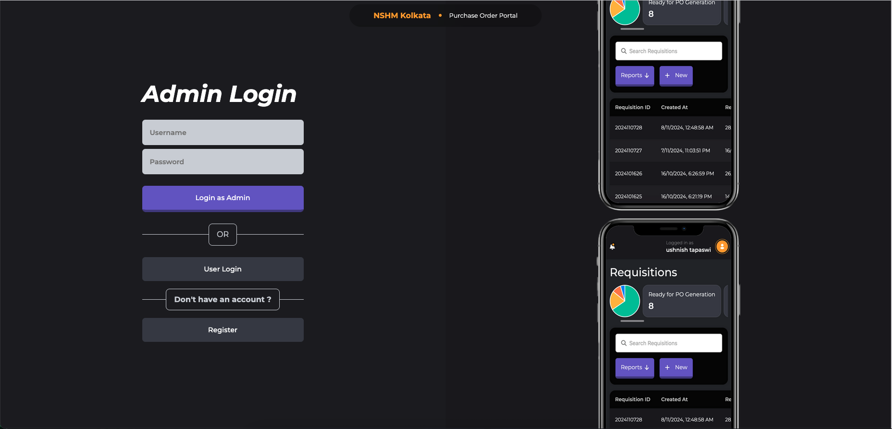
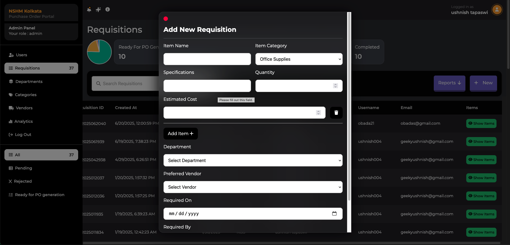
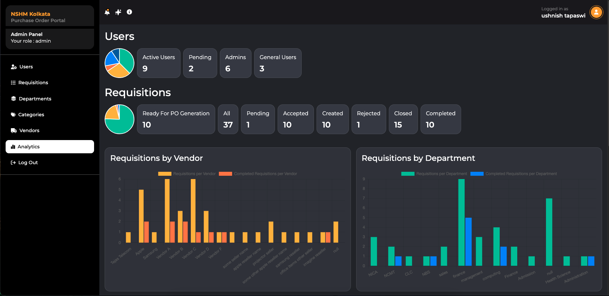

# Purchase Order System for NSHM Knowledge Campus, Kolkata



This is a purchase order system I built for my college as my major project.




Check `Preview` directory for more preview screenshots of the app

## Tech Stack 

### Frontend

React, Sass

### Backend

Express.js, Node.js, MySQL, Google Gemini

## Key features

- Implemented JWT-based authentication for secure access.

- Enabled users to create requisitions and track their status directly from the user dashboard.

- Built an admin panel where admins can manage users, create/edit/approve/delete requisitions, and generate Purchase Order receipts using a custom NSHM Knowledge Campus, Kolkata template.

- Admin dashboard includes full CRUD operations for Users, Requisitions, Departments, and Vendors.

- Added an analytics section with detailed requisition insights, plus an AI-powered helper and analysis tool (powered by Gemini).

## Getting Started

#### 1. Install dependencies

- Server dependencies
```bash 
cd server
npm install
```
- Client dependencies
```bash
cd client
npm install
```

#### 2. Configure Database

- Create a new database in MySQL workbench or preferred SQL manager like PHP MyAdmin and name it `POS_NSHM`. 
Make sure not to name it anything else except the one specified. Run the following command to do so :
`CREATE DATABASE POS_NSHM;`
- Create a new query tab and execute the query
`USE POS-NSHM;`
- Copy paste the contents of `POS_NSHM.sql` without any trailing comments at the top or bottom of the file to the query tab
- Execute all

### 3. Configure .env

Check out `.env.example` in `client` and `server`
and create your `.env` files accordingly.

#### 3. Running the App

- Run `npm start` on both `client` and `server`

#### 4. Log in using test account

- Go to the Register page
- Fill up and submit the Register form.
- Login with the following credentials (Login as Admin):

Username : ushnish004
Password : ushnish004

- Go to the Users section by clicking on the ‘Users’ Menu in the Sidebar
- Find the request you created and select ‘accept as admin’
- You can now Login with your account as admin and manage all users, requisitions, and
the software.